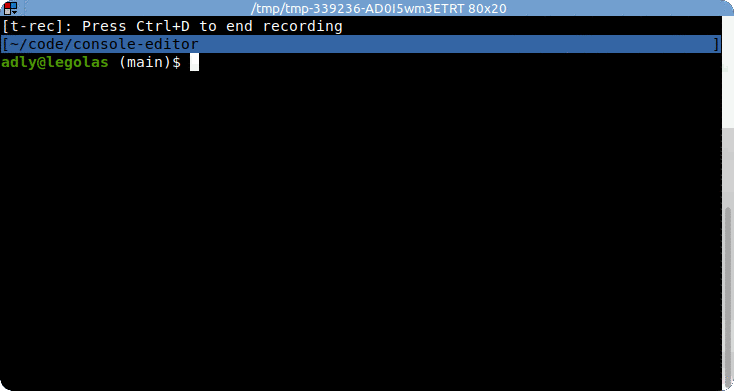
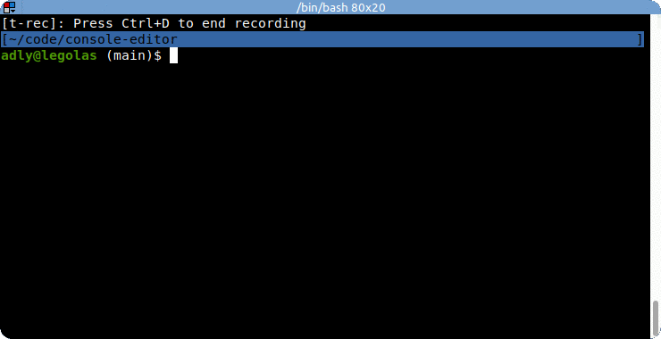

# console-editor

Edit object properties or functions in a real editor

### Usage:

This is meant to be used from withing the node repl or from an interactive program.
Currently all functions are synchronous so this is not really suitable to be used
in servers or long-running services.

The module exposes one function which can be used to edit functions and objects in
a terminal editor such as `vim` or `slap`. It will launch the editor you configured
in the `$VISUAL` or `$EDITOR` environment variable.

    > edit = require('console-editor')
	> edit(some_function)
	> edit(some_object,'property_name')
	> edit(some_array,1)

Since this is a module you may also use this in your own terminal app. The spawned
editor will take over your **stdin**, **stdout** and **stderr** until you quit the
editor.

Note that due to the way variables work in javascript only array members and object
properties may be edited. This is because it is not possible to access the variable
itself from javascript, only the variable's value. Because arrays and objects are
references we can modify their members and properties.

Also note that functions are edited in global scope. You will most likely lose
any closure scope you had before the edit.

### Installation

Just install it via npm:

    npm install console-editor

	# or globally:
	npm install -g console-editor

